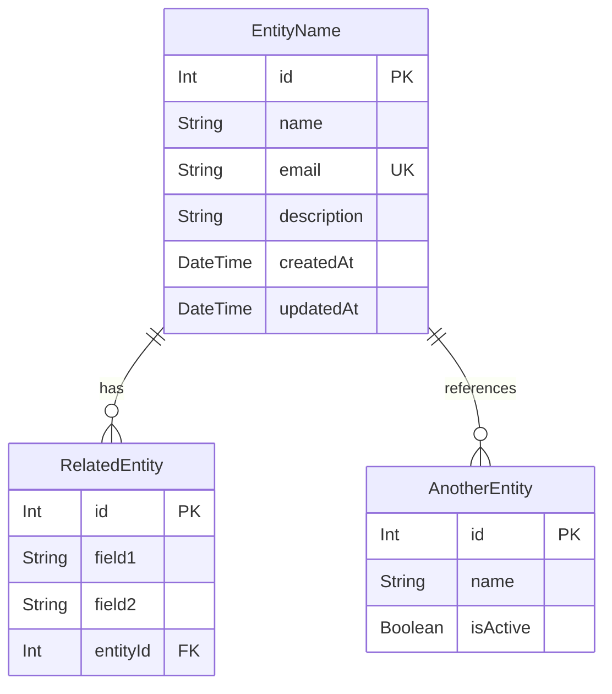

# Data Model Documentation

This document describes the data model for the application, including entity descriptions, field definitions, relationships, and an entity-relationship diagram.

## Model Descriptions

### 1. EntityName
Brief description of what this entity represents in the system.

**Fields:**
- `id`: Unique identifier for the entity (Primary Key)
- `name`: Entity name (max X characters)
- `email`: Entity email address (optional/required, max X characters)
- `description`: Entity description (optional, max X characters)
- `createdAt`: Timestamp when the entity was created
- `updatedAt`: Timestamp when the entity was last updated

**Validation Rules:**
- Name is required, X-Y characters
- Email must follow valid email format if provided
- Description cannot exceed X characters if provided
- [Add other validation rules as needed]

**Relationships:**
- `relatedEntities`: One-to-many relationship with RelatedEntity model
- `parentEntity`: Many-to-one relationship with ParentEntity model

### 2. RelatedEntity
Brief description of what this related entity represents.

**Fields:**
- `id`: Unique identifier (Primary Key)
- `field1`: Description of field1 (max X characters)
- `field2`: Description of field2 (max X characters)
- `entityId`: Foreign key referencing the main Entity

**Validation Rules:**
- Field1 is required and cannot exceed X characters
- Field2 is optional but must be valid if provided
- [Add other validation rules as needed]

**Relationships:**
- `entity`: Many-to-one relationship with EntityName model

## Entity Relationship Diagram

## Key Design Principles

1. **Referential Integrity**: All foreign key relationships ensure data consistency across the system.

2. **Flexibility**: The data model allows for customizable configurations and extensibility.

3. **Audit Trail**: Timestamp fields provide a complete timeline of entity changes.

4. **Extensibility**: The modular design allows for easy addition of new features and data points.

5. **Data Normalization**: The model follows database normalization principles to minimize redundancy and ensure data integrity.

## Notes

- All `id` fields serve as primary keys with auto-increment functionality
- Foreign key relationships maintain referential integrity
- Optional fields allow for flexible data entry while maintaining required core information
- Email fields (if present) should have unique constraints to prevent duplicate accounts
- Timestamps should be automatically managed by the ORM or database
